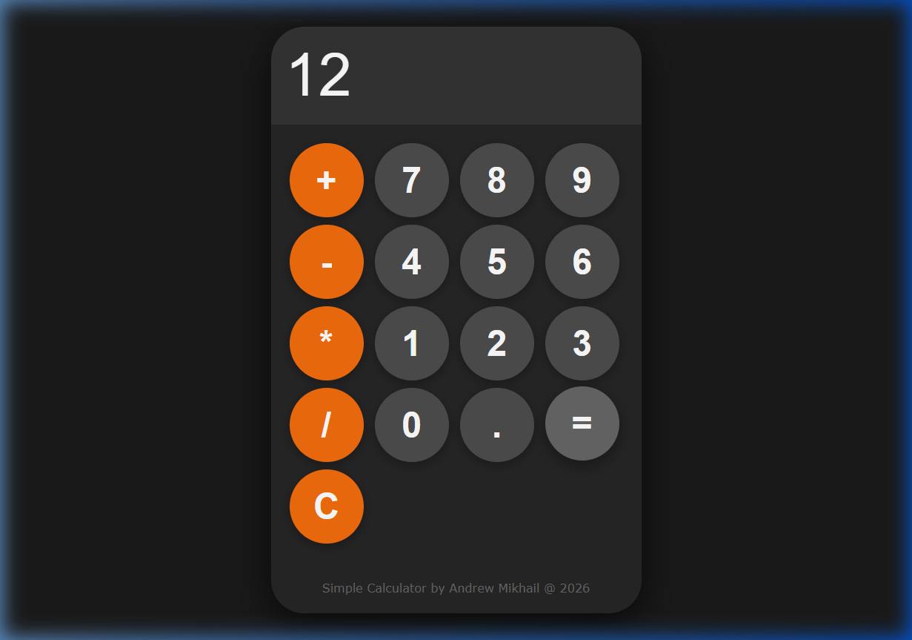

# 🧮 Modern Simple Calculator -|- [Simple Calculator (Live Preview)](https://cyber752.github.io/Simple-Calculator/)

A sleek, responsive, and high-performance calculator built with horizontal glassmorphism aesthetics and smooth micro-animations. Designed for both desktop and mobile use with full keyboard support.



## ✨ Key Features

- **🎯 Precision Logic**: Handles basic arithmetic operations (+, -, *, /) with high reliability using JavaScript.
- **⌨️ Keyboard Support**: Full interactive support for physical keyboards—numbers, operators, Enter, Backspace, and 'C' key.
- **🎨 Premium Aesthetics**:
  - **Glassmorphism Design**: Deep shadows and HSL-based color palettes for a state-of-the-art look.
  - **Micro-Animations**: Experience satisfying button presses, display flashes on update, and error-shake feedback.
- **📱 True Responsive Design**: Adapts seamlessly to any screen size, ensuring a perfect user experience on smartphones, tablets, and desktops.
- **⚡ Zero Dependency**: Built entirely with Vanilla HTML, CSS, and JS—ultra-lightweight and blazingly fast.

## 🛠️ Technology Stack

- **HTML5**: Semantic structure for accessibility and SEO.
- **CSS3**: Advanced animations, Flexbox/Grid layouts, and HSL color modeling.
- **JavaScript (ES6+)**: Event-driven logic and real-time DOM manipulation.

## 🚀 Quick Start

1.  **Clone the repository**:
    ```bash
    git clone https://github.com/cyber752/Simple-Calculator-using-HTML--JS--and-CSS.git
    ```
2.  **Open the project**:
    Simply open `index.html` in your favorite browser.

## ⌨️ Keyboard Shortcuts

| Key | Action |
| :--- | :--- |
| `0-9` | Input Digits |
| `+`, `-`, `*`, `/` | Basic Operators |
| `Enter` or `=` | Calculate Result |
| `Backspace` | Delete Last Digit |
| `C` | Clear Entire Display |

## 📂 Project Structure

```text
.
├── assets/      # Application screenshots
├── index.html   # Main application structure
├── style.css    # Premium styling & animations
├── logic.js     # Core calculation engine
└── README.md    # Project documentation
```

---

<div align="center">

**Developed with ❤️ by Andrew Mikhail**
*© 2026 - All Rights Reserved*

</div>
